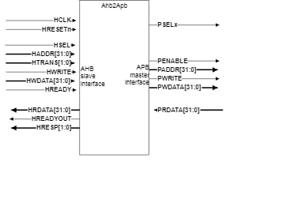
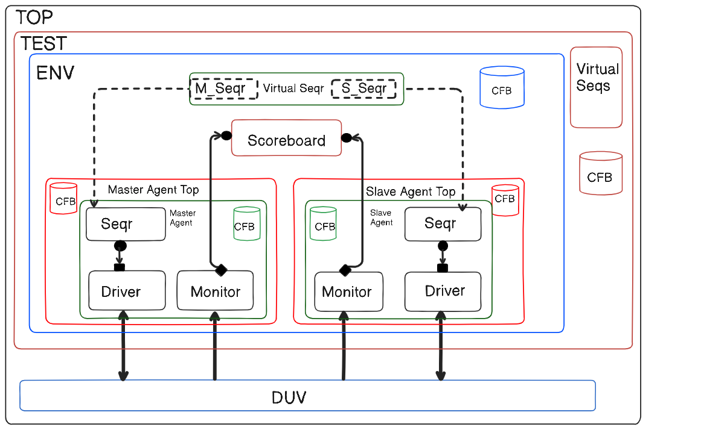

## AHB to APB Bridge Verification
* AHB-to-APB Bridge Verification using UVM Methodology.

The AHB to APB bridge is an AHB slave which works as an interface between the high speed AHB and the low performance APB buses. DUT is AHB-to-APB Bridge which is AHB Slave and APB Master. We will use 1 AHB Master and 1 APB Slave. Need to verify whether the data sent by the AHB Master has reached the APB slave and vice versa.

Bridge will do the following: Latches address and holds it valid throughout the transfer. Decodes address and generates peripheral select. Only one select signal can be active during a transfer. Drives data onto the APB for a write transfer. Drives APB data onto system bus for a read transfer. Generates PENABLE for the transfer.

## 📋 Table of Contents
1. [Protocol Features](#1-protocol-features)
   * AHB Features
   * APB Features
   * Protocol Comparison
2. [Implementation Details](#2-implementation-details)
   * Verification Components
   * Test Scenarios
3. [AHB Transfer Sequences](#3-ahb-transfer-sequences)
   * Base Sequence
   * Single Transfer
   * Increment Burst
   * Wrap Burst
4. [Verification Results](#4-verification-results)

## 1. Protocol Features

### 🚀 Advanced High-Performance Bus (AHB) Features
* High-performance, high-bandwidth protocol
* Pipelined operations support
* Multiple bus masters
* Burst transfers
* Split transactions
* Single-clock edge operation
* Non-tristate implementation
* Supports frequencies up to ~150MHz
* Data bus widths of 32/64/128 bits
* Address bus width up to 32 bits
* Multiple outstanding transactions capability

### 🔌 Advanced Peripheral Bus (APB) Features
* Low power peripheral communication
* Simplified interface protocol
* Latched address and control signals
* No burst transfers
* Suitable for low-speed peripherals
* Simple interface with minimal power consumption
* Typically 32-bit data bus width
* Non-pipelined protocol
* Two-stage transaction (setup + enable)
* Single master only

### 📊 Protocol Comparison Table

| Feature | AHB | APB |
|---------|-----|-----|
| Performance | High-performance | Low-power, simple |
| Bandwidth | High | Low to medium |
| Complexity | Complex | Simple |
| Pipelining | Yes | No |
| Burst Transfer | Supported | Not supported |
| Logic Level | Logic Low(0),Logic High(1) |Logic Low(0),Logic High(1)  |
| Transaction Stages | Single stage | Two stages (Setup + Enable) |
| Target Devices | High-speed memories, DMA | Low-speed peripherals |
| Power Consumption | Higher | Lower |
| Data Bus | 32/64/128-bit | Typically 32-bit |
| Outstanding Transactions | Multiple | Single |
| Wait States | Supported | Supported |

## AHB2APB Bridge Module

## 2. Implementation Details

### 🛠 Verification Components
1. **AHB to APB Bridge**
   * Complete UVM-based verification environment
   * Protocol conversion verification
   * Data integrity checks
   * Error scenarios handling

2. **AHB Side Verification**
   * Master agent implementation
   * Protocol compliance checks
   * Burst transfer verification
   * Wait state handling

3. **APB Side Verification**
   * Slave response verification
   * Setup and enable phase checks
   * Error response handling
   * Transfer completion verification

### 🧪 Test Scenarios
1. **Basic Transfers**
   * Single read/write operations
   * Back-to-back transfers
   * Idle cycles

2. **Advanced Features**
   * Burst transfers on AHB side
   * Wait state insertion
   * Error responses
   * Reset during transfer
   * Different transfer sizes
## TB Architecture

## 3. AHB Transfer Sequences

### 🔤 Base Sequence Class
```systemverilog
class master_seqs extends uvm_sequence #(master_xtn);
    `uvm_object_utils(master_seqs)
    
    logic [31:0] haddr;
    logic hwrite;
    logic [2:0] hsize;
    logic [2:0] hburst;
```

**Key Attributes:**
* Base class for all AHB transfer sequences
* Defines common transaction parameters
* Supports UVM sequence infrastructure
[Uploa# AHB Signal Description

| Hburst[2:0] | Type    | Description                                  |
|-------------|---------|----------------------------------------------|
| 000         | Single  | Single Transfer                              |
| 001         | INCR    | Incrementing length of unspecified length    |
| 010         | WRAP4   | 4-beat wrapping burst                        |
| 011         | INCR4   | 4-beat Incrementing burst                    |
| 100         | WRAP8   | 8-beat wrapping burst                        |
| 101         | INCR8   | 8-beat Incrementing burst                    |
| 110         | WRAP16  | 16-beat wrapping burst                       |
| 111         | INCR16  | 16-beat incrementing burst                   |

## Description:
The AHB burst signal (`HBURST[2:0]`) indicates the type of burst being performed. The burst may be:
- Single transfer
- Incrementing burst of unspecified length
- Fixed-length wrapping bursts (4, 8, or 16 beats)
- Fixed-length incrementing bursts (4, 8, or 16 beats)

### Burst Types
1. **Single Transfer (000)**
   - Performs a single data transfer

2. **Incrementing Burst (001)**
   - Length is not specified at the start of burst
   - Address increments after each transfer
* **Address Calculation:**
```
New_Address = Previous_Address + (2^Size)
```

3. **Wrapping Burst (WRAP4/8/16)**
   - Fixed length of 4, 8, or 16 beats
   - Address wraps at boundary
   - Used for cache line operations

* **Boundary Calculations:**
```
Starting_addr = (haddr/((2^hsize) * Length)) * ((2^hsize) * Length)
Boundary_addr = Starting_addr + ((2^hsize) * Length)
```

4. **Incrementing Burst (INCR4/8/16)**
   - Fixed length of 4, 8, or 16 beats
   - Address increments after each transfer
   - Used for block transfersding ahb-signal-docs.md…]()

**Example (WRAP4, 2-byte transfer):**
* Initial address: 24
* Starting address: (24/(4*2))*(4*2) = 24
* Boundary address: 24 + (2*4) = 32
* Sequence: 24 → 26 → 28 → 30 → 24 (wraps)

**For EXAMPLE (Scoreboard comparing valid signals):**
* Comparing based on the Haddr, Paddr, and Hwdata, Pwdata.
* The key operation happens under these conditions:
1. Hwrite == 1: Indicates a write operation
2. Hwrite == 0: Indicates a read operation
3. Hsize == 2'b00: Specifies 1-byte data transfer (2^0 = 1 byte)
          *  2'b01: 2 bytes (16 bits)
          *  2'b10: 4 bytes (32 bits)
          *  2'b11: 8 bytes (64 bits)
   
* Example-
* Hwrite== 1
* Hsize== 2'b00 (1bytes)
* Haddr== 2e882088

**Address Breakdown:**

* The address Haddr = 0x2E882088 is a 32-bit address.
*It is broken down into 4 bytes:
**Byte 4:** 0x2E, **Byte 3:** 0x88, **Byte 2:** 0x20, **Byte 1:** 0x88.

* **Byte Selection Based on Hsize:**
* Since Hsize == 2'b00 (indicating a 1-byte transaction), only the least significant byte (Byte 1) will be used for the data transfer.
* The lower 2 bits of Haddr (i.e., Haddr[1:0]) are checked to determine which byte to select for transfer. In this case, Haddr[1:0] == 00, meaning Byte 1 (0x88) is selected for the data transfer.

**Address Matching:**

* The system compares the master's address (Haddr) with the slave's address (Paddr).
* If they match, the address is successfully verified. If they don't match, an address mismatch occurs.

**Data Verification:**

* The data to be transferred is stored in Hwdata = 0x3E 0x5F 0x22 0x94, broken down into 4 bytes:

* **Byte 4:** 0x3E, **Byte 3:** 0x5F, **Byte 2:** 0x22, **Byte 1:** 0x94.
* The lower **2 bits** of each byte are examined for the transfer:
* For Hwdata[7:0] (Byte 1), the value is 0x94. Its 2-bit value is 00, indicating the byte is being transferred.
* The system then checks if the slave's data (Pdata) matches the byte being transferred.
* If Pdata matches Hwdata[7:0] (0x94), the data is **successfully matched**. If they don't match, the data is considered a **mismatch**.

**Summary:**
* **Address Match:** Ensures the correct byte of memory is accessed based on the Haddr and Paddr.
* **Data Match:** Verifies the transferred data (Hwdata) matches the expected data (Pdata).

## 4. Verification Guidelines

### 🎯 Coverage Points
1. **Transfer Types**
   * All burst types
   * All transfer sizes
   * Address boundaries
   * Wrap conditions

2. **Protocol Transitions**
   * AHB to APB conversion
   * Wait states
   * Error responses

### 🧪 Test Requirements
1. **Basic Functionality**
   * Single transfers
   * Burst transfers
   * Address alignment

2. **Corner Cases**
   * Boundary conditions
   * Error scenarios
   * Reset behavior

3. **Performance**
   * Throughput
   * Latency
   * Bus utilization


*For any updates or modifications, please contact the verification team.*

